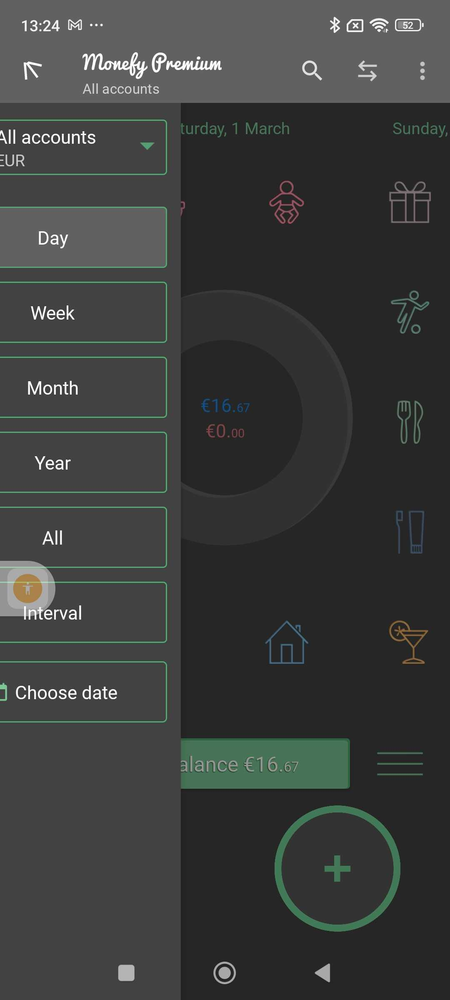
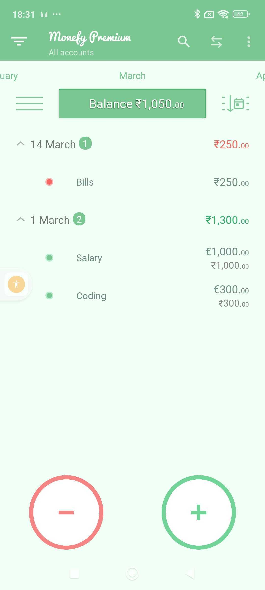
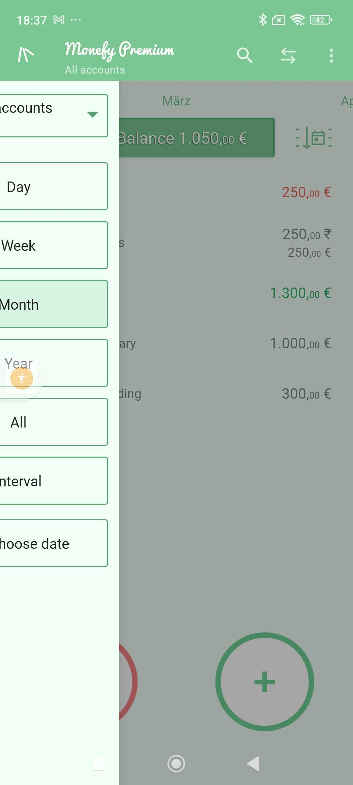

# Exploratory Testing Report: Monefy – Budget & Expenses App

## Test Charter

**Title:** Evaluating Core Functionalities and User Experience of Monefy App
**Area Under Test:** Income & Expense Tracking, Manage currency & Catogory, Synchronization, Data correctness and User Interface
**Goal:** Assess the app's usability and accessibility, feature set, and identify potential issues affecting user experience
**Test Approach:** Manual exploratory testing for free and Pro and focusing on key functionalities and user interactions

---

## Testing Charters


| Feature                               | Description                                                                           | Expected Outcome                                                                                     | Actual Outcome                                                                                     | Status | Additional Details                                                                                                        |
| ------------------------------------- | ------------------------------------------------------------------------------------- | ---------------------------------------------------------------------------------------------------- | -------------------------------------------------------------------------------------------------- | ------ | ------------------------------------------------------------------------------------------------------------------------- |
| Income Management                     | Adding an income of 1000 euro income single currrency single category.                | View income is added with correct category and amount in daily and monthly view.                    | Income added successfully and can view in list view                                                | ✅     |                                                                                                                           |
| Income + Budget Management            | Set budget of 500 + Add an income of 1000 euro single currrency single category.    | View income and budget is added with correct category and amount in daily and monthly view.         | Income added successfully.<br />                                                                   | 🔶     |   |
| Income Management                    | Adding incomes in 2 different currencies one custom and one already added category    | View incomes is added with correct category and amount                                               | Incomes added successfully and can view in list view. The total of income is correct.             | ✅     |                                                                                                                           |
| Expense Management                    | Adding an expense of 250 and 300 euro in single currrency without budget setting     | View expense is added with correct category and amount and can view in list view and pie chart view | Expense added successfully and can view in list view and pie chart view                           | ✅     |                                                                                                                           |
| Expense Management                    | Adding an expense single currrency custom category                                    | View expense is added with custom category and amount and can view in list view and pie chart view  | Expense added successfully and can view in list view and pie chart view                           | ✅     |                                                                                                                           |
| Expense Management                    | Adding an expense 2 different currrencies and one custom and already added category | View expense is added with custom category and amount and can view in list view and pie chart view  | Expense added successfully and can view in list view and pie chart view                           | ✅     |                                                                                                                           |
| Expense Management                    | Editing an existing expense change currency, amount, category                         | Ability to modify expense details and can view in list view and pie chart view                      | Editing functionality works as expected                                                            | ✅     |                                                                                                                           |
| Balance Settings                      | Set budget, carry over and Future recurring records                                   | Ability to set and view  the budget,carryover and recurring records                                 | Budget , carryover features works as expected                                                      | ✅     |                                                                                                                           |
| User Interface                        | Change the language of the app                                                        | Able to Language of the app to deutche should change                                                | Every text changes to the deutche. Not every text changes or very few changes to deutche language. | ❌     |                                                                                                                           |
| User Interface                        | Change the currency of the app                                                        | Able to currency of the app to deutche should change                                                | Feature available and functions correctly                                                          | ✅     |                                                                                                                           |
| Synchronization/Subscription restore | Synchonise data in one device and access in another after purchase                    | Should be able to synchronise data in one device and then restore in another                         | Without authentication and authorisation cannot restore via new device                             | ❌     |                                                                                                                           |
| Security                              | Enable the passcode protection and fingerprint                                        | Should be able to enable the passcode and fingerprint protection                                     | Not able to enable the passcode protection and fingerprint protection                              | ❌     |                                                                                                                           |
| Data Correctness                      | Verify percentage correctness of expenses                                             | The percentage and piechart view should be correct                                                   | The percentage is correct                                                                          | ✅     |                                                                                                                           |
| Accessibility                         | Run accessibility scans                                                               | No major accessibility critical issues should exists                                                 | Budget settings apply globally; lacks per-month customization                                      | ❌     |                                                                                                                           |

---

## Bugs


| Feature                        | Bug                                                                                                              | Details                                                                                                                                   |
| ------------------------------ | ---------------------------------------------------------------------------------------------------------------- | ----------------------------------------------------------------------------------------------------------------------------------------- |
| UI Interface                   | The initial user experience in the Monefy app is confusing and unintuitive.                                      | Some features available which doesnot work.                                                                                               |
| Settings(Syncronization)       | After subscribing no option to unsubscribe<br />and unable to restore subscription in other device               |                                                                                                                                           |
| Passcode Protection            | Neither the passcode nor the fingerprint passcode can be enabled                                                 |                                                                                                                                           |
| Settings(Syncronization)       | Can't find the way to restore the purchase made in other device.                                                 | Cannot retore the purchase in other device                                                                                                |
| Income/Expense Management      | The currency conversion is not dynamic and have to be added manually                                             |                                                                                                                                           |
| Income/Expense Management      | Budget can be set monthly only but<br />expense limit per day is calculate by divding by 30 in 1 day view       |   |
| Income/Expense Management      | The currency conversion is not dynamic and have to be added manually                                             |                                                                                                                                           |
| Income/Expense Management      | The currency conversion only works if in past<br />the conversion rate is added<br /> else raw numerics are used |                   |
| Settings(Budget,currency etc.) | All text doesnot change to deutche when changing the language                                                    |                   |

```

```

---

## Prioritization of Charters


| Charter Title                             | Severity | Priority | Reason                                                                                                                                                |
| ----------------------------------------- | -------- | -------- | ----------------------------------------------------------------------------------------------------------------------------------------------------- |
| Income + Expense Management               | Highest  | Medium   | Core feature essential for app's primary purpose can be priority if there is critical bug                                                             |
| User Interface Responsiveness             | Medium   | High     | Directly impacts user satisfaction and usability                                                                                                      |
| Synchronization/Subscription Restore (P1) | High     | Highest  | No login, subscription cannot be restored there is a risk of loosing data                                                                             |
| Accessibility                             | Medium   | High     | Can be priotise if going to launch the app in EU location<br />as by June 28, 2025 <br />digital products needs to be WCAG 2.1 complaint as per EAA |
| Security                                  | Medium   | Medium   | Useful feature depends on user complaints for priotization                                                                                            |
| Data Correctness                          | Highest  | Low      | Most important feature but doesnot have critical bug                                                                                                  |
| Balance Settings                          | High     | Medium   | Useful feature but not critical for basic budgeting needs.                                                                                            |
| Performance                               | Medium   | Low      | Useful feature but not critical for basic budgeting needs right now.Can be protise if have serious issues.                                            |

---

## Risk Assessment

**Risks to Mitigate for This Application:**

- **Data Correctness Risk:** The correctness of data(expenses and income in different currencies), percentage calculation etc has to be correct
- Data Loss Risk: There is no login and purchase cannot be restored there is a risk of loosing data, or some settings can make loose the data.
- **Security Risk:** As authorization/authentication not there for some users it can be of greater concern
- The lack of intuitive designs can confuse users which can drop downloads

---

> _Prepared by:_ **Siddharth Kala**
> **
